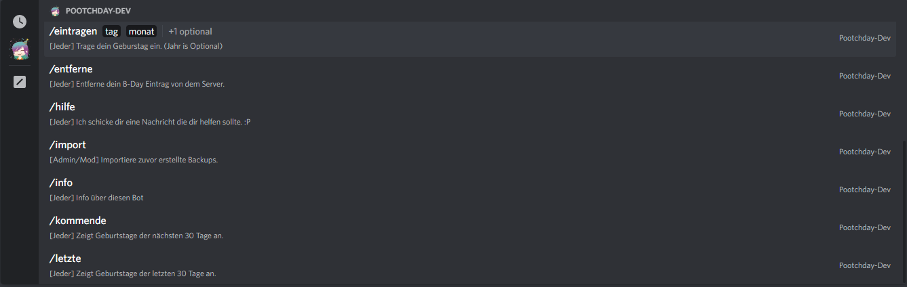

# Pootchday
Geburtstags Bot für Discord auf Deutsch!
Der Bot wurde komplett mit den neuen / Slashbefehlen entwickelt.

Einlade Link: https://discord.com/api/oauth2/authorize?client_id=972494503665618954&permissions=1239366765568&scope=applications.commands%20bot

## Was kann der Bot?
- Mit diesem Bot können Benutzer Ihren Geburtstag eintragen und werden an Ihrem Geburtstag erwähnt.
- Man kann auch die Geburtstage der letzten oder kommenden 30 Tage anzeigen.
- Zusätzlich gibt es diverse Einstellungsmöglichkeiten wie:
  - In welchem Channel sollen die Benutzer beglückwünscht werden.
  - Modrolle für /einstellung Slashbefehle setzen
  - Eigenen glückwunsch Text setzen.
  - Ob die Benutzer am Tag angepingt (also mit @ erwähnt werden sollen) oder nicht.
Und einiges mehr. Schaut euch dafür einfach die Slashbefehle an.

## Wie bekomme ich Hilfe?
Sobald Ihr den Bot auf euren Server eingeladen habt, könnt Ihr mit /hilfe euch eine bebilderte Hilfe zukommen lassen.
Server Owner, oder falls die ModRolle eingestellt wurde, bekommen zusätzliche Hilfe für Servereinstellungen.

